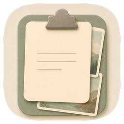

<p align="center">
  
</p>

<h1 align="center">ClipTrace</h1>

<p align="center">
  <strong>English</strong> · <a href="README.zh-CN.md">中文</a>
</p>

<p align="center">
  A lightweight macOS clipboard manager with local semantic search, MCP integration, and a warm, muted aesthetic.
</p>

---

## Features

### Core
- **Auto-monitoring** — captures text, images, video, files, URLs, and rich text in real time
- **One-click copy** — double-click any entry to write it back to the clipboard
- **Duplicate refresh** — re-copying an existing item bumps it to the top instead of creating a duplicate
- **Trim trailing whitespace** — optionally strip trailing spaces/newlines on re-copy
- **Screen recording hide** — exclude the window from screen captures and screen sharing
- **Global hotkeys** — `⌘⇧V` for main window, `⌘N` for new snippet

### Organization
- **Favorites & Pinned** — star or pin entries; pinned items float to the top with a collapsible section
- **Tags** — add/remove tags per item; search by tag with autocomplete
- **Multi-select & Merge** — select 2+ items of the same type and merge them with configurable separators
- **Soft-delete Trash** — deleted items go to trash; restore or permanently delete; auto-purge after configurable days

### Smart Search
- **Full-text search** with type filters (text / image / video / file / URL / rich text)
- **Semantic search** — powered by Apple NLEmbedding, fully offline, zero cost
- **Tag search mode** — every word is a tag candidate with autocomplete
- **Auto-backfill** — missing embeddings are computed on launch
- **Fallback** — semantic results empty? Falls back to keyword search automatically

### Preview & Content Awareness
- **Rich preview popover** — hover to preview any item
- **Smart parsing** — auto-detects epoch timestamps, Base64, and JSON in text content
- **Video preview** — configurable: first-frame thumbnail or inline player with mute toggle
- **URL sanitization** — strips 28+ tracking parameters (UTM, fbclid, gclid, etc.) on copy

### Snippets
- **Manual snippets** — `⌘N` opens the editor; saved items auto-pin and join the semantic index
- **Source tag** — labeled as "Snippet" in the list for easy identification

### Export & Stats
- **JSON export** — filter by type, date range, favorites/pinned
- **Per-item export** — right-click to save as original format (txt, png, etc.)
- **Copy stats** — daily count, 14-day bar chart, GitHub-style heatmap

### AI Integration (MCP Server)

The app binary doubles as a [Model Context Protocol](https://modelcontextprotocol.io/) stdio server. Connect it to Claude Desktop, Claude Code, or Cursor to let AI search your clipboard.

```json
{
  "mcpServers": {
    "clipboard": {
      "command": "/Applications/ClipTrace.app/Contents/MacOS/ClipTrace",
      "args": ["--mcp"]
    }
  }
}
```

| Tool | Parameters | Description |
|---|---|---|
| `search_clipboard` | `query`, `limit?`, `semantic?` | Keyword or semantic search over history |
| `list_recent` | `limit?`, `type?` | Latest N items, optionally filtered by type |
| `get_clip` | `id` | Full content + metadata for a single item |

## System Requirements

- macOS 14.0 (Sonoma) or later
- Xcode 15.0+ / Swift 5.9+

## Build & Run

**Xcode:** Open `ClipTrace.xcodeproj`, select "My Mac", hit Run.

**Command line:**
```bash
xcodebuild -project ClipTrace.xcodeproj -scheme ClipTrace -configuration Debug build
```

## Keyboard Shortcuts

| Shortcut | Action |
|---|---|
| `⌘⇧V` | Open main window |
| `⌘,` | Open settings |
| `⌘N` | New snippet |
| `⌘⏎` | Save in snippet editor |
| `Esc` | Dismiss preview / go back / cancel edit |

## Privacy

- All data stored locally via SwiftData (SQLite)
- Semantic search uses Apple NLEmbedding — **fully offline**, no network requests
- MCP server runs locally over stdio; no outbound connections
- No analytics, no telemetry, no data collection
- Per-app exclusion, per-type retention, URL tracking stripping built in

## License

MIT
